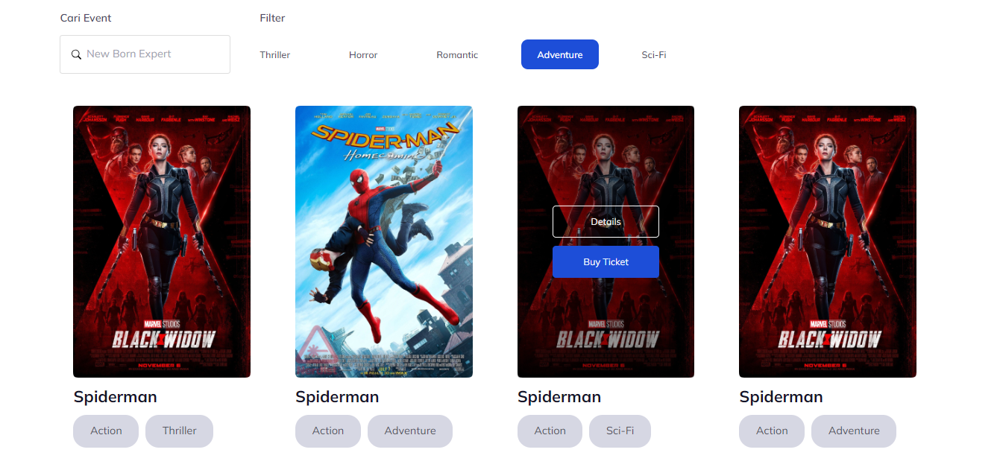
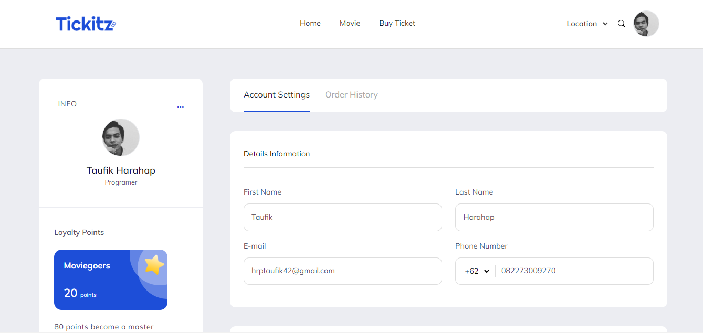
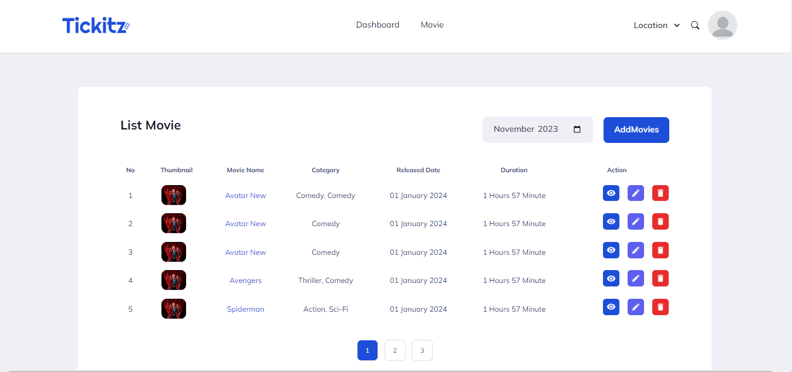

<h1 align="center">
  Tickitz App With React and Tailwind
</h1>

<p align="center"></p>
<p align="center"></p>
<p align="center"></p>
<p align="center"></p>

## 🛠️ Installation Steps

1. Clone the repository

```bash
git clone https://github.com/taufikharahap/TickitzApp-React-Tailwind.git
```

2. Install dependencies

```bash
npm install
```

3. Run the app

```bash
npm run dev
```

🌟 You are all set!

## 💻 Built with

-   JavaScript
-   React Js
-   React-Redux
-   Tailwind

<hr>
<p align="center">
Developed with ❤️ in Indonesia 	🇮🇩
</p>
